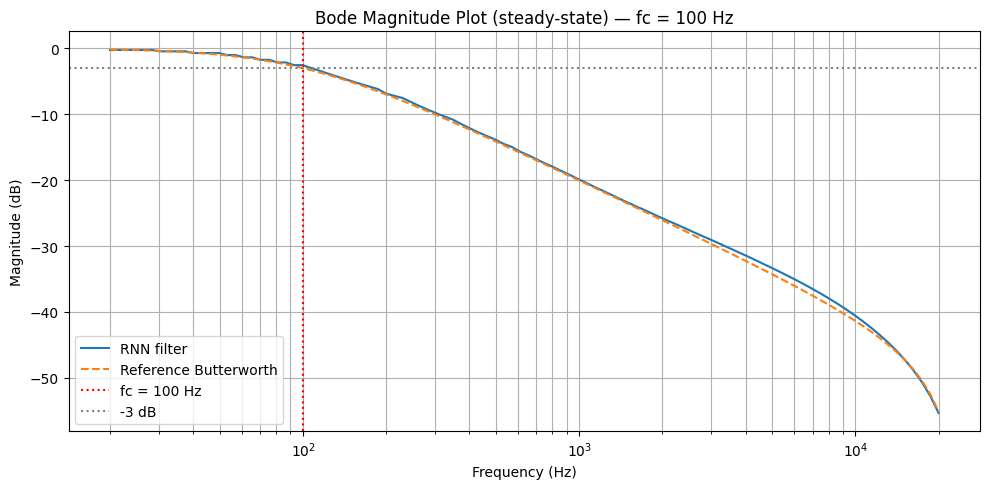
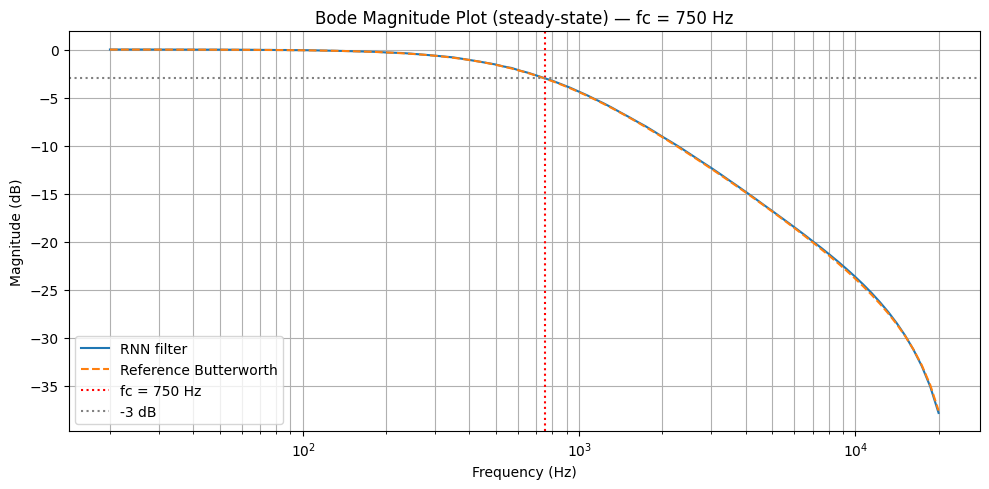
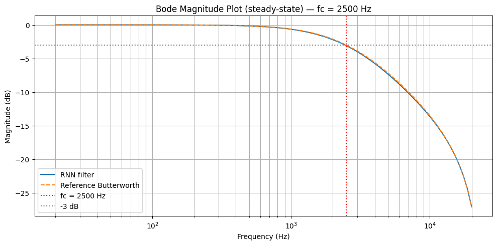

<!-- Improved compatibility of back to top link: See: https://github.com/othneildrew/Best-README-Template/pull/73 -->
<a id="readme-top"></a>
<!--
*** Thanks for checking out the Best-README-Template. If you have a suggestion
*** that would make this better, please fork the repo and create a pull request
*** or simply open an issue with the tag "enhancement".
*** Don't forget to give the project a star!
*** Thanks again! Now go create something AMAZING! :D
-->


<!-- PROJECT SHIELDS -->
<!--
*** I'm using markdown "reference style" links for readability.
*** Reference links are enclosed in brackets [ ] instead of parentheses ( ).
*** See the bottom of this document for the declaration of the reference variables
*** for contributors-url, forks-url, etc. This is an optional, concise syntax you may use.
*** https://www.markdownguide.org/basic-syntax/#reference-style-links
-->
[![Contributors][contributors-shield]][contributors-url]
[![Forks][forks-shield]][forks-url]
[![Stargazers][stars-shield]][stars-url]
[![Issues][issues-shield]][issues-url]
[![project_license][license-shield]][license-url]
[![LinkedIn][linkedin-shield]][linkedin-url]


<!-- PROJECT LOGO -->
<br />
<div align="center">
  <a href="https://github.com/grybouilli/first-order-lowpass-GRU">
    <!--  -->
  </a>

<h3 align="center">First Order Lowpass Filter GRU</h3>

  <p align="center">
    A Gated Reccurent Unit that models a first order lowpass filter.
    <br />
    <a href="https://github.com/grybouilli/first-order-lowpass-GRU"><strong>Explore the docs »</strong></a>
    <br />
    <br />
    <a href="https://github.com/grybouilli/first-order-lowpass-GRU">View Demo</a>
    &middot;
    <a href="https://github.com/grybouilli/first-order-lowpass-GRU/issues/new?labels=bug&template=bug-report---.md">Report Bug</a>
    &middot;
    <a href="https://github.com/grybouilli/first-order-lowpass-GRU/issues/new?labels=enhancement&template=feature-request---.md">Request Feature</a>
  </p>
</div>


<!-- TABLE OF CONTENTS -->
<details>
  <summary>Table of Contents</summary>
  <ol>
    <li>
      <a href="#about-the-project">About The Project</a>
    </li>
    <li>
      <a href="#getting-started">Getting Started</a>
      <ul>
        <li><a href="#prerequisites">Prerequisites</a></li>
        <li><a href="#installation">Installation</a></li>
      </ul>
    </li>
    <li><a href="#usage">Usage</a></li>
    <li><a href="#roadmap">Roadmap</a></li>
    <li><a href="#contributing">Contributing</a></li>
    <li><a href="#license">License</a></li>
    <li><a href="#contact">Contact</a></li>
    <li><a href="#acknowledgments">Acknowledgments</a></li>
  </ol>
</details>


<!-- ABOUT THE PROJECT -->
## About The Project

<!-- [![Product Name Screen Shot][product-screenshot]](https://example.com) -->

This repo contains python scripts for :
* An input-size agnostic GRU model : takes a buffer of audio samples and a normalized$^*$ cut-off frequency, and outputs the filtered buffer according to given cutoff frequency
* A script to generate a training dataset
* A training script for the model 
* A model evaluation notebook to analyse the model's accuracy and quality with notably Bode graphs
* A script to export a trained model to the ONNX Runtime format 
* An example of C++ code using ONNX Runtime to run inference of the exported model

<p align="right">(<a href="#readme-top">back to top</a>)</p>

$^*$: See function `normalize_freq` in [`create_dataset_v2.py`](./create_dataset_v2.py).
<!-- GETTING STARTED -->
## Getting Started
### Prerequisites

Start by creating a virtual python environment and install the needed dependencies. Note that if you want to use your GPU to train your model, you need should check [the dedicated Pytorch page](https://pytorch.org/get-started/locally/) and replace dedicated dependencies in `requirements.txt` accordingly. 

* You can create the environment with the needed dependencies by running :
  ```bash
  python -m venv .venv
  source .venv/bin/activate
  pip install -r requirements.txt # Check wanted pytorch package before running this line
  ```

### Training
Here we present how to train your own model and the recommended parameters to use.

#### Recommendations
Great result were obtained with a GRU model of **hidden size 64** and of **number of layers equal to 2**.

The sample rate used was 48kHz. The buffer size during training was 1024. The number of epochs was 50. The model was trained using a NVIDIA RTX 3050 Ti.

The obtained model produced the following bode plots :





#### Dataset generation
The dataset generation script produces samples of white noise and sine sweeps. 

The generated white noise has specific characteristics :
* It is bandlimited to the hearable domain, which is delimited by the sample rate
* A linear amplitude ramp is applied to the signal so the model is training on both low and high intensity signal

White noise and sine sweeps are a great training material as they offer the possibility for the model to train on multi-harmonic signals. See Parker et. al, "Modelling of nonlinear state-space systems using a deep neural network", 2019.

The dataset generation script will generate a folder `dataset-n` (where n is an integer incrementing by one) which will contain two subfolders :
* inputs : this folder contains `.npy` files named `input-x.npy`, which are numpy arrays filled with either white noise or sine sweeps. The last value of the array is the normalized cut-off frequency to use to obtain the corresponding `./expected/expected-x.npy` signal.
* expected : this folder contains `.npy` files named `expected-x.npy`, which are numpy arrays filled with the filtered version of `./inputs/input-x.npy`. The last value of the array `./inputs/input-x.npy` is used as the normalized cut-off frequency to obtain the corresponding `./expected/expected-x.npy` signal.

Because the normalized frequency is stored in the input array, inputs will have size `len(expected)+1`.

Example of command to generate a dataset :
```bash
$ python create_dataset_v2.py --sample_rate=48000 --buffer_size=128 --amount_of_fc=300 --max_buffer_amount=5
```

An overview of the available parameters to generate the dataset:
```bash
$ python create_dataset_v2.py --help
usage: create_dataset_v2.py [-h] [--sample_rate SAMPLE_RATE] [--buffer_size BUFFER_SIZE] [--amount_of_fc AMOUNT_OF_FC]
                            [--max_buffer_amount MAX_BUFFER_AMOUNT]

options:
  -h, --help            show this help message and exit
  --sample_rate SAMPLE_RATE
                        Generated signal sample-rate
  --buffer_size BUFFER_SIZE
                        Generated signal will have buffer_size * max_buffer_amount samples
  --amount_of_fc AMOUNT_OF_FC
                        Expected signals will be filtered with frequencies ranging from 50 to 7500 Hz on a logarithmic scale. This option gives the amount
                        of cut-off frequencies to use.
  --max_buffer_amount MAX_BUFFER_AMOUNT
                        Generated signal will have buffer_size * max_buffer_amount samples
```
#### Model training

After sourcing the environment and generating a dataset, you can run the training script with :
```bash
$ python train.py --buffer_size=1024 --hidden_size=1024 --num_layers=2
```

A quick glance at the available parameters :

```bash
$ python train.py --help
usage: train.py [-h] [--buffer_size BUFFER_SIZE] [--dataset DATASET] [--epochs EPOCHS] [--hidden_size HIDDEN_SIZE] [--num_layers NUM_LAYERS]

options:
  -h, --help            show this help message and exit
  --buffer_size BUFFER_SIZE
                        Amount of samples passed as input to the GRU model during forward pass
  --dataset DATASET     Folder which should contain two subfolders ./inputs and ./expected, that represent the training dataset generated with
                        create_dataset_v2.py
  --epochs EPOCHS       The amount of epoch for training
  --hidden_size HIDDEN_SIZE
                        The hidden size of the GRU
  --num_layers NUM_LAYERS
                        The number of layers in the GRU

```

<p align="right">(<a href="#readme-top">back to top</a>)</p>


<!-- USAGE EXAMPLES -->
## Model inference
### Model evaluation
### Model inference using ONNX Runtime


<!-- ROADMAP -->
## Roadmap

### General
- [ ] Finish README.md

### Training
- [X] Add validation loss in training
- [ ] Implement other filters
  - [ ] n-th order filters
  - [ ] other types than lowpass
  - [ ] other algo than butterworth
  
### Inference
- [ ] Implement JUCE VST Plugin to use the model
- [ ] Try other inference engines
    - [ ] RTNeural
    - [ ] TF Lite
    - [ ] Executorch

See the [open issues](https://github.com/grybouilli/first-order-lowpass-GRU/issues) for a full list of proposed features (and known issues).

<p align="right">(<a href="#readme-top">back to top</a>)</p>


<!-- CONTRIBUTING -->
## Contributing

Contributions are what make the open source community such an amazing place to learn, inspire, and create. Any contributions you make are **greatly appreciated**.

If you have a suggestion that would make this better, please fork the repo and create a pull request. You can also simply open an issue with the tag "enhancement".
Don't forget to give the project a star! Thanks again!

1. Fork the Project
2. Create your Feature Branch (`git checkout -b feature/AmazingFeature`)
3. Commit your Changes (`git commit -m 'Add some AmazingFeature'`)
4. Push to the Branch (`git push origin feature/AmazingFeature`)
5. Open a Pull Request

<p align="right">(<a href="#readme-top">back to top</a>)</p>

### Top contributors:

<a href="https://github.com/grybouilli/first-order-lowpass-GRU/graphs/contributors">
  
</a>


<!-- LICENSE -->
## License

Distributed under the MIT License. See `LICENSE.txt` for more information.

<p align="right">(<a href="#readme-top">back to top</a>)</p>


<!-- CONTACT -->
## Contact

Nicolas Gry - grybouilli at outlook.fr

Project Link: [https://github.com/grybouilli/first-order-lowpass-GRU](https://github.com/grybouilli/first-order-lowpass-GRU)

<p align="right">(<a href="#readme-top">back to top</a>)</p>


<!-- MARKDOWN LINKS & IMAGES -->
<!-- https://www.markdownguide.org/basic-syntax/#reference-style-links -->
[contributors-shield]: https://img.shields.io/github/contributors/grybouilli/first-order-lowpass-GRU.svg?style=for-the-badge
[contributors-url]: https://github.com/grybouilli/first-order-lowpass-GRU/graphs/contributors
[forks-shield]: https://img.shields.io/github/forks/grybouilli/first-order-lowpass-GRU.svg?style=for-the-badge
[forks-url]: https://github.com/grybouilli/first-order-lowpass-GRU/network/members
[stars-shield]: https://img.shields.io/github/stars/grybouilli/first-order-lowpass-GRU.svg?style=for-the-badge
[stars-url]: https://github.com/grybouilli/first-order-lowpass-GRU/stargazers
[issues-shield]: https://img.shields.io/github/issues/grybouilli/first-order-lowpass-GRU.svg?style=for-the-badge
[issues-url]: https://github.com/grybouilli/first-order-lowpass-GRU/issues
[license-shield]: https://img.shields.io/github/license/grybouilli/first-order-lowpass-GRU.svg?style=for-the-badge
[license-url]: https://github.com/grybouilli/first-order-lowpass-GRU/blob/master/LICENSE.txt
[linkedin-shield]: https://img.shields.io/badge/-LinkedIn-black.svg?style=for-the-badge&logo=linkedin&colorB=555
[linkedin-url]: https://linkedin.com/in/nicolas-gry
[product-screenshot]: images/screenshot.png
